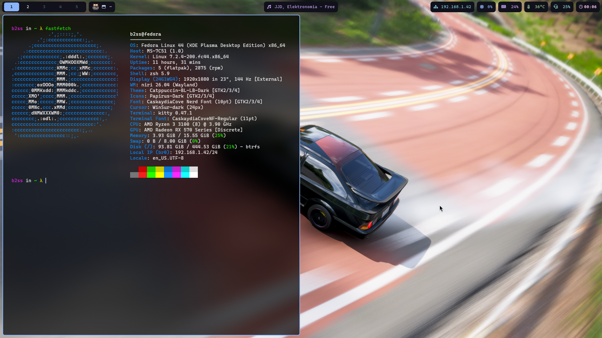

# niri-rice-dots

Simple rice for niri, edit the files to your own personal preferences, you might need a Nerd Font, in my case is CaskaydiaCove Nerd Font. I'm also using zsh and oh-my-zsh with the half-life theme.

